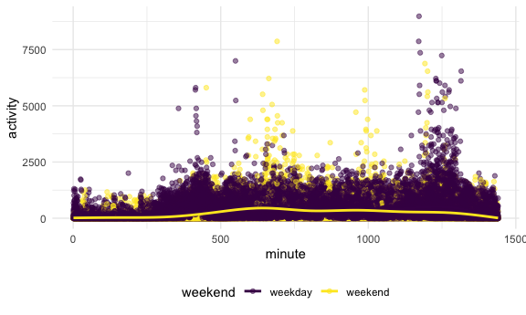

Homework 3
================
October 4, 2020

This is my solution to Homework 3

Problem 0

I have created….

``` r
library(tidyverse)
```

    ## ── Attaching packages ───────────────────────────────────────────────────────────────────────── tidyverse 1.3.0 ──

    ## ✓ ggplot2 3.3.2     ✓ purrr   0.3.4
    ## ✓ tibble  3.0.3     ✓ dplyr   1.0.2
    ## ✓ tidyr   1.1.2     ✓ stringr 1.4.0
    ## ✓ readr   1.3.1     ✓ forcats 0.5.0

    ## ── Conflicts ──────────────────────────────────────────────────────────────────────────── tidyverse_conflicts() ──
    ## x dplyr::filter() masks stats::filter()
    ## x dplyr::lag()    masks stats::lag()

``` r
knitr::opts_chunk$set(
  fig.width = 6,
  fig.asp = .6,
  out.width = "90%"
)

theme_set(theme_minimal() + theme(legend.position = "bottom"))

options(
  ggplot2.continuous.colour = "viridis",
  ggplot2.continuous.fill = "viridis"
)

scale_colour_discrete = scale_color_viridis_d
scale_fill_discrete = scale_fill_viridis_d
```

Problem 1

``` r
library(p8105.datasets)
data("instacart")
```

My initial exploratory code:

``` r
instacart %>% 
  group_by(user_id) %>% 
  summarize(n_obs = n())
```

    ## `summarise()` ungrouping output (override with `.groups` argument)

    ## # A tibble: 131,209 x 2
    ##    user_id n_obs
    ##      <int> <int>
    ##  1       1    11
    ##  2       2    31
    ##  3       5     9
    ##  4       7     9
    ##  5       8    18
    ##  6       9    22
    ##  7      10     4
    ##  8      13     5
    ##  9      14    11
    ## 10      17     6
    ## # … with 131,199 more rows

``` r
instacart %>% 
  group_by(product_id) %>% 
  summarize(n_obs = n())
```

    ## `summarise()` ungrouping output (override with `.groups` argument)

    ## # A tibble: 39,123 x 2
    ##    product_id n_obs
    ##         <int> <int>
    ##  1          1    76
    ##  2          2     4
    ##  3          3     6
    ##  4          4    22
    ##  5          5     1
    ##  6          7     1
    ##  7          8    13
    ##  8          9     5
    ##  9         10   119
    ## 10         11     2
    ## # … with 39,113 more rows

``` r
instacart %>% 
  group_by(product_name) %>% 
  summarize(n_obs = n())
```

    ## `summarise()` ungrouping output (override with `.groups` argument)

    ## # A tibble: 39,123 x 2
    ##    product_name                                                            n_obs
    ##    <chr>                                                                   <int>
    ##  1 "\\\"Constant Comment\\\" Black Tea"                                        3
    ##  2 "\\\"Constant Comment\\\" Decaffeinated Black Tea Blend"                    3
    ##  3 "\\\"Darn Good\\\" Chili Mix"                                               5
    ##  4 "\\\"Im Pei-nut Butter\\\" Double Chocolate Cookie & Peanut Butter Ice…     5
    ##  5 "\\\"Mies Vanilla Rohe\\\" Ice Cream Bars"                                  6
    ##  6 "\\\"Mokaccino\\\" Milk + Blue Bottle Coffee Chocolate"                    10
    ##  7 "& Go! Hazelnut Spread + Pretzel Sticks"                                   10
    ##  8 "#2 Coffee Filters"                                                        22
    ##  9 "#2 Cone White Coffee Filters"                                              1
    ## 10 "#2 Mechanical Pencils"                                                     1
    ## # … with 39,113 more rows

``` r
instacart %>% 
  group_by(aisle) %>% 
  summarize(n_obs = n())
```

    ## `summarise()` ungrouping output (override with `.groups` argument)

    ## # A tibble: 134 x 2
    ##    aisle                  n_obs
    ##    <chr>                  <int>
    ##  1 air fresheners candles  1067
    ##  2 asian foods             7007
    ##  3 baby accessories         306
    ##  4 baby bath body care      328
    ##  5 baby food formula      13198
    ##  6 bakery desserts         1501
    ##  7 baking ingredients     13088
    ##  8 baking supplies decor   1094
    ##  9 beauty                   287
    ## 10 beers coolers           1839
    ## # … with 124 more rows

``` r
instacart %>% 
  group_by(aisle, order_id) %>% 
  summarize(n_obs = n())
```

    ## `summarise()` regrouping output by 'aisle' (override with `.groups` argument)

    ## # A tibble: 990,769 x 3
    ## # Groups:   aisle [134]
    ##    aisle                  order_id n_obs
    ##    <chr>                     <int> <int>
    ##  1 air fresheners candles    13749     1
    ##  2 air fresheners candles    14585     2
    ##  3 air fresheners candles    15177     2
    ##  4 air fresheners candles    27660     1
    ##  5 air fresheners candles    28046     1
    ##  6 air fresheners candles    33894     1
    ##  7 air fresheners candles    34969     1
    ##  8 air fresheners candles    37509     1
    ##  9 air fresheners candles    43286     1
    ## 10 air fresheners candles    43699     2
    ## # … with 990,759 more rows

``` r
instacart %>% 
  group_by(department) %>% 
  summarize(n_obs = n())
```

    ## `summarise()` ungrouping output (override with `.groups` argument)

    ## # A tibble: 21 x 2
    ##    department       n_obs
    ##    <chr>            <int>
    ##  1 alcohol           5598
    ##  2 babies           14941
    ##  3 bakery           48394
    ##  4 beverages       114046
    ##  5 breakfast        29500
    ##  6 bulk              1359
    ##  7 canned goods     46799
    ##  8 dairy eggs      217051
    ##  9 deli             44291
    ## 10 dry goods pasta  38713
    ## # … with 11 more rows

``` r
instacart %>% 
  count(department, name = "n_obs")
```

    ## # A tibble: 21 x 2
    ##    department       n_obs
    ##    <chr>            <int>
    ##  1 alcohol           5598
    ##  2 babies           14941
    ##  3 bakery           48394
    ##  4 beverages       114046
    ##  5 breakfast        29500
    ##  6 bulk              1359
    ##  7 canned goods     46799
    ##  8 dairy eggs      217051
    ##  9 deli             44291
    ## 10 dry goods pasta  38713
    ## # … with 11 more rows

``` r
instacart %>% 
  count(order_number, name = "n_obs")
```

    ## # A tibble: 97 x 2
    ##    order_number  n_obs
    ##           <int>  <int>
    ##  1            4 149882
    ##  2            5 123548
    ##  3            6 105328
    ##  4            7  90949
    ##  5            8  75645
    ##  6            9  68366
    ##  7           10  60216
    ##  8           11  51530
    ##  9           12  47819
    ## 10           13  42072
    ## # … with 87 more rows

``` r
instacart %>% 
  group_by(aisle, order_number) %>% 
  relocate(aisle, order_number) %>% 
  mutate(order_number_rank = min_rank(desc(order_number))) %>% 
  relocate(aisle, order_number_rank, order_number) %>% 
  summarize(n_obs = n())
```

    ## `summarise()` regrouping output by 'aisle' (override with `.groups` argument)

    ## # A tibble: 11,279 x 3
    ## # Groups:   aisle [134]
    ##    aisle                  order_number n_obs
    ##    <chr>                         <int> <int>
    ##  1 air fresheners candles            4   126
    ##  2 air fresheners candles            5    93
    ##  3 air fresheners candles            6    97
    ##  4 air fresheners candles            7    72
    ##  5 air fresheners candles            8    46
    ##  6 air fresheners candles            9    53
    ##  7 air fresheners candles           10    65
    ##  8 air fresheners candles           11    58
    ##  9 air fresheners candles           12    36
    ## 10 air fresheners candles           13    34
    ## # … with 11,269 more rows

The instacart dataset contains 1384617 rows and 15 columns. This is a
big dataframe\! There appears to be 131,209 distinct user identification
numbers. There are 39,123 distinct product identification numbers
corresponding to 39,123 product names, including “Im Pei-nut Butter”
double chocolate cookie & peanut butter ice cream and \#2 mechanical
pencils as just two examples. There are 134 aisle identification numbers
corresponding to 134 aisles including air freshener candles, beer
coolers, and baby food formula as some examples. There are 21 department
identification numbers corresponding to 21 departments, including
alcohol, babies, and dry goods pasta as some examples.

Observations are the level of items in orders by user. There are user /
order variables – user ID, order ID, order day, and order hour. There
are also item variables – name, aisle, department, and some numeric
codes.

How many aisles, and which are most items from? (this is a question
about counting) Answer: There are 134 aisles and the top three aisles
are (1) fresh vegetables, (2) fresh fruits, and (3) packaged vegetables
fruits

``` r
instacart %>% 
  count(aisle) %>% 
  arrange(desc(n))
```

    ## # A tibble: 134 x 2
    ##    aisle                              n
    ##    <chr>                          <int>
    ##  1 fresh vegetables              150609
    ##  2 fresh fruits                  150473
    ##  3 packaged vegetables fruits     78493
    ##  4 yogurt                         55240
    ##  5 packaged cheese                41699
    ##  6 water seltzer sparkling water  36617
    ##  7 milk                           32644
    ##  8 chips pretzels                 31269
    ##  9 soy lactosefree                26240
    ## 10 bread                          23635
    ## # … with 124 more rows

\*desc(n) from most to least

``` r
instacart %>% 
  count(aisle) %>% 
  arrange(n)
```

    ## # A tibble: 134 x 2
    ##    aisle                          n
    ##    <chr>                      <int>
    ##  1 beauty                       287
    ##  2 frozen juice                 294
    ##  3 baby accessories             306
    ##  4 baby bath body care          328
    ##  5 kitchen supplies             448
    ##  6 specialty wines champagnes   461
    ##  7 ice cream toppings           504
    ##  8 shave needs                  532
    ##  9 skin care                    534
    ## 10 first aid                    539
    ## # … with 124 more rows

\*without the desc() function, lists from least to most

Let’s make a plot (this is a filtering problem)

``` r
instacart %>% 
  count(aisle) %>% 
  filter(n > 10000) %>% 
  ggplot(aes(x = aisle, y = n)) +
  geom_point()
```


\*output is problematic

1)  rotate axis labels. google “rotate text”

<!-- end list -->

``` r
instacart %>% 
  count(aisle) %>% 
  filter(n > 10000) %>% 
  ggplot(aes(x = aisle, y = n)) +
  geom_point() +
  theme(axis.text.x = element_text(angle = 90, vjust = 0.5, hjust=1))
```


2)  a sensible way to arrange is to put from least number of products on
    left to most on right (x axis). Key concept is to realize that
    should recode categorical variable (aisle) to factor.

<!-- end list -->

``` r
instacart %>% 
  count(aisle) %>% 
  filter(n > 10000) %>% 
  mutate(
    aisle = factor(aisle),
    aisle = fct_reorder(aisle, n)
  ) %>% 
  ggplot(aes(x = aisle, y = n)) +
  geom_point() +
  theme(axis.text.x = element_text(angle = 90, vjust = 0.5, hjust=1))
```


Let’s make a table\!\!

``` r
instacart %>% 
  filter(aisle %in% c("baking ingredients", "dog food care", "packaged vegetables fruits")) %>% 
  group_by(aisle) %>%
  count(product_name) %>% 
  mutate(
    rank = min_rank(desc(n))
  ) %>% 
  filter(rank < 4) %>% 
  arrange(aisle, rank) %>% 
  knitr::kable()
```

| aisle                      | product\_name                                 |    n | rank |
| :------------------------- | :-------------------------------------------- | ---: | ---: |
| baking ingredients         | Light Brown Sugar                             |  499 |    1 |
| baking ingredients         | Pure Baking Soda                              |  387 |    2 |
| baking ingredients         | Cane Sugar                                    |  336 |    3 |
| dog food care              | Snack Sticks Chicken & Rice Recipe Dog Treats |   30 |    1 |
| dog food care              | Organix Chicken & Brown Rice Recipe           |   28 |    2 |
| dog food care              | Small Dog Biscuits                            |   26 |    3 |
| packaged vegetables fruits | Organic Baby Spinach                          | 9784 |    1 |
| packaged vegetables fruits | Organic Raspberries                           | 5546 |    2 |
| packaged vegetables fruits | Organic Blueberries                           | 4966 |    3 |

Pink lady apples and coffee ice cream

``` r
instacart %>% 
  filter(product_name %in% c("Pink Lady Apples", "Coffee Ice Cream")) %>% 
  group_by(product_name, order_dow) %>% 
  summarize(mean_hour = mean(order_hour_of_day)) %>% 
  pivot_wider(
    names_from = order_dow,
    values_from = mean_hour
  )
```

    ## `summarise()` regrouping output by 'product_name' (override with `.groups` argument)

    ## # A tibble: 2 x 8
    ## # Groups:   product_name [2]
    ##   product_name       `0`   `1`   `2`   `3`   `4`   `5`   `6`
    ##   <chr>            <dbl> <dbl> <dbl> <dbl> <dbl> <dbl> <dbl>
    ## 1 Coffee Ice Cream  13.8  14.3  15.4  15.3  15.2  12.3  13.8
    ## 2 Pink Lady Apples  13.4  11.4  11.7  14.2  11.6  12.8  11.9

Problem 2

part 1 first part of question: importing, cleaning, and tidying data:
import the data file will need to convert to long form mutate

``` r
accel_df =
  read_csv("./data/accel_data.csv") %>% 
  pivot_longer(
    activity.1:activity.1440,
    names_to = "minute",
    names_prefix = "activity.",
    values_to = "activity"
  ) %>%
  mutate(
    weekend = recode(day, "Monday" = "weekday", "Tuesday" =  "weekday", "Wednesday" = "weekday",                      "Thursday" = "weekday", "Friday" = "weekday", "Saturday" = "weekend",                                           "Sunday" = "weekend"),
    minute = as.double(minute)
    ) %>% 
  rename(day_of_week = day)
```

    ## Parsed with column specification:
    ## cols(
    ##   .default = col_double(),
    ##   day = col_character()
    ## )

    ## See spec(...) for full column specifications.

The Accelerometer dataset contains five weeks of data from a single
individual, a 63 year old nonobese male, who was admitted to Columbia
University Medical Center for congestive heart failure. The dataset
contains activity data every minute of every day for 35 days (5 weeks).
The dataset consists of a week variable, day\_id variable, a day of the
week variable, minute variable, activity variable, and weekend variable,
which indicates whether the day is a weekday or weekend. The dataset is
in long format with 50400 columns and 6 columns.

part 2 if anything doesn’t make sense, may need to refer back to part 1
aggregate. pretty specific. essentially a group\_by and summarize()
problem. end up with table with 35 days and average measures of activity
counts. are there any trends. goal here is after tidy, group by and
summarize, and try to make sense of it.

``` r
accel_df %>% 
  group_by(day_id, day_of_week, weekend) %>% 
  summarize(total_activity = sum(activity)) %>%
  knitr::kable()
```

    ## `summarise()` regrouping output by 'day_id', 'day_of_week' (override with `.groups` argument)

| day\_id | day\_of\_week | weekend | total\_activity |
| ------: | :------------ | :------ | --------------: |
|       1 | Friday        | weekday |       480542.62 |
|       2 | Monday        | weekday |        78828.07 |
|       3 | Saturday      | weekend |       376254.00 |
|       4 | Sunday        | weekend |       631105.00 |
|       5 | Thursday      | weekday |       355923.64 |
|       6 | Tuesday       | weekday |       307094.24 |
|       7 | Wednesday     | weekday |       340115.01 |
|       8 | Friday        | weekday |       568839.00 |
|       9 | Monday        | weekday |       295431.00 |
|      10 | Saturday      | weekend |       607175.00 |
|      11 | Sunday        | weekend |       422018.00 |
|      12 | Thursday      | weekday |       474048.00 |
|      13 | Tuesday       | weekday |       423245.00 |
|      14 | Wednesday     | weekday |       440962.00 |
|      15 | Friday        | weekday |       467420.00 |
|      16 | Monday        | weekday |       685910.00 |
|      17 | Saturday      | weekend |       382928.00 |
|      18 | Sunday        | weekend |       467052.00 |
|      19 | Thursday      | weekday |       371230.00 |
|      20 | Tuesday       | weekday |       381507.00 |
|      21 | Wednesday     | weekday |       468869.00 |
|      22 | Friday        | weekday |       154049.00 |
|      23 | Monday        | weekday |       409450.00 |
|      24 | Saturday      | weekend |         1440.00 |
|      25 | Sunday        | weekend |       260617.00 |
|      26 | Thursday      | weekday |       340291.00 |
|      27 | Tuesday       | weekday |       319568.00 |
|      28 | Wednesday     | weekday |       434460.00 |
|      29 | Friday        | weekday |       620860.00 |
|      30 | Monday        | weekday |       389080.00 |
|      31 | Saturday      | weekend |         1440.00 |
|      32 | Sunday        | weekend |       138421.00 |
|      33 | Thursday      | weekday |       549658.00 |
|      34 | Tuesday       | weekday |       367824.00 |
|      35 | Wednesday     | weekday |       445366.00 |

On visual inspection of total activity by day, there appears to be a few
days where total activity appears lower than usual. These days are day 2
(a Monday), day 24 (a Saturday), day 31 (another Saturday). The two
Saturdays have the exact same activity level (1440), which corresponds
to the number of minutes in a day. It is unclear whether the
accelerometers was placed on those Saturdays or if there was an
equipment malfunction. Otherwise, it is difficult to get a general trend
without doing further analyses (e.g. descriptive statistics or plots)

part 3 if anything doesn’t make sense, may need to refer back to part 1
first goal is show activity count (y axis) as function of minute (x
axis) from there, add geoms, start adding in some pieces (scatterplot
with geom\_plot). color is day of week (aesthetic plot) maybe plot is
going to show something obvious? activity level night vs day? activity
level weekday vs. weekend?

two things that ar potential issues part 2 table - day of week as column
(may default to alphabetical order - so may have to convert to factor to
order it in a meaningul way) part 1 pivot long - watch out for when you
tidy, make sure later on the plots are showing what you want to show.
watch out for variable classes when you tidy.

``` r
accel_df %>% 
  ggplot(aes(x = minute, y = activity, color = day_of_week)) +
  geom_point(alpha = .5) +
  geom_smooth(se = FALSE)
```

    ## `geom_smooth()` using method = 'gam' and formula 'y ~ s(x, bs = "cs")'


``` r
accel_df %>% 
  ggplot(aes(x = minute, y = activity, color = weekend)) +
  geom_point(alpha = .5) +
  geom_smooth(se = FALSE)
```

    ## `geom_smooth()` using method = 'gam' and formula 'y ~ s(x, bs = "cs")'



In general, the scatterplot has many data points. Activity is generally
low from midnight to about 415 minutes (about 7 AM), at which point
there is a general increase in activity, with some higher levels of
activity, particularly on Thursdays. On Fridays, there seems to also be
increased activity after 500 minutes and on Sundays, increased activity
later in the evening. A quick plot of weekday vs. weekend activity could
yield more information:

A scatterplot of weekday vs. weekend time periods shows increased
activity earlier on weekdays, suggesting the patient wakes up earlier.
On weekends, activity increased begin later, suggesting he sleeps in. On
weekends, he has increased activity around 1000 minutes that isn’t
present on weekdays. On weekdays, there seems to be another increase in
activity at 1250 minutes (between 8 and 9 PM) greater than on weekends.
We can obtain additional information by taking a history from the
patient.

Problem 3 ny noaa dataset

part 1 separate() to make columns for different dates check for
reasonable units - tenths of degree C? might want to change to degrees C
for snowfall, this is a issue of count()

part 2 quite a bit there to unpack. mostly a collection of data
manipulation steps followed by a plot - how to i need to organize my
data so I can have avg group\_by and summarize problem. ggplot thrown on
top. group by station, group by year, group by month, and then summarize
to get what you want. Only care about Jan and July - filter() fuunction
somewhere - and probably early on. then the plotting step - y axis avg
max temp x axis month - repeated by station 1, 2, 3, etc

part 3 merging two separate plots (probably patchwork) first one -
scatterplot is bad b/c too many datapoints. use hex plot, bin plot, etc.
second plot - first need filtering step. then show a distribution: box
plot, violin plot, ridge plot perhaps by year: 1981, 1982, 1983, etc.
